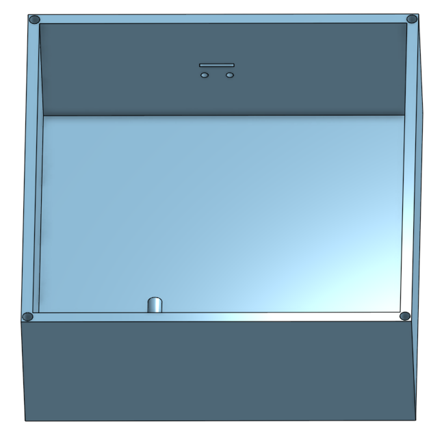
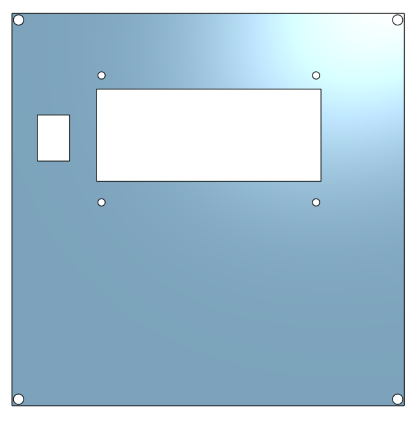
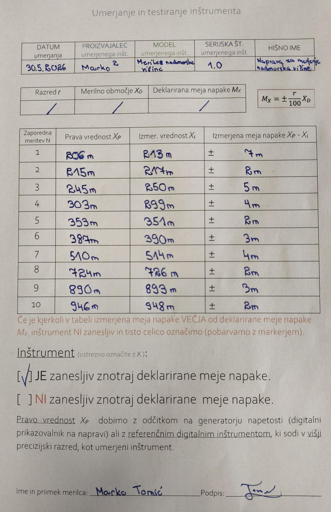

# Merjenje nadmorske višine

### 1. Opis projekta
Ustvarila sva napravo za merjenje nadmorske višine. Uporabila sva senzor BME280, ki s pomočjo meritev temprerature, vlage in tlaka skozi programsko kodo izračuna nadmorsko višino. Na LCD zaslonu se prikazujejo vsi podatki, ki vplivajo na izračun nadmorske višine (temperatura, vlaga, tlak) ter nadmorska višina v hekto paskalih (hPa).

### 2. Kosovnica
* Arduino UNO
* LCD 20x4
* BME280 senzor
* Stikalo za vklop/izklop
* Baterijski konektor
* Baterija
* Hitra sponka
* Povezovalne žičke

### 3. Vezalna shema

### 4. Načrt ohišja

### Pokrov

### 5. Izračuni in enačbe
Za izdelavo najine vezave nisva potrebovala komponent, ki bi potrebovale posebne enačbe.

### 6. Videoposnetek delovanja

### 7. A-test

### 8. Komentar
Merilna naprava deluje stabilno in v skladu s pričakovanji, meja napake je v mejah normale. Meritve so bile narejene, ko je bil zračni tlak približno 1022 hPa. Ker je bil zračni tlak v času kalibracije blizu standardne vrednosti, so izračuni nadmorske višine natančni. Z vezavo sva imela veliko problemov, žičke so se velikokrat staknile

### 9. Izboljšave
Za izboljšavo merilnika nadmorske višine bi lahko dodali gumba za kalibracijo zračnega tlaka v realnem času, uvedli programsko glajenje podatkov z drsnim povprečjem ali napravo opremili z GPS modulom in MicroSD kartico za beleženje poti.
