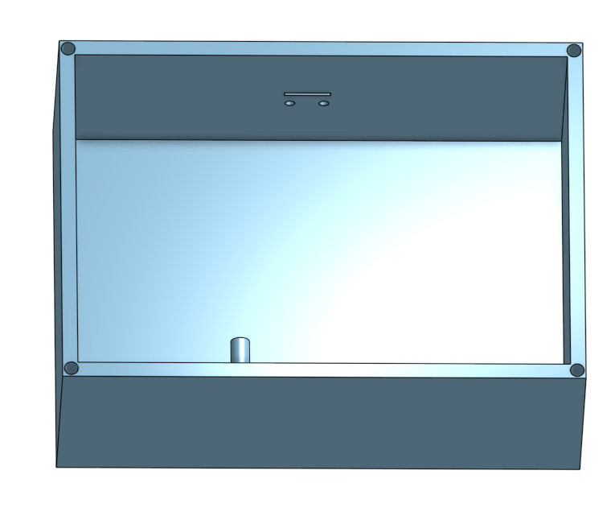
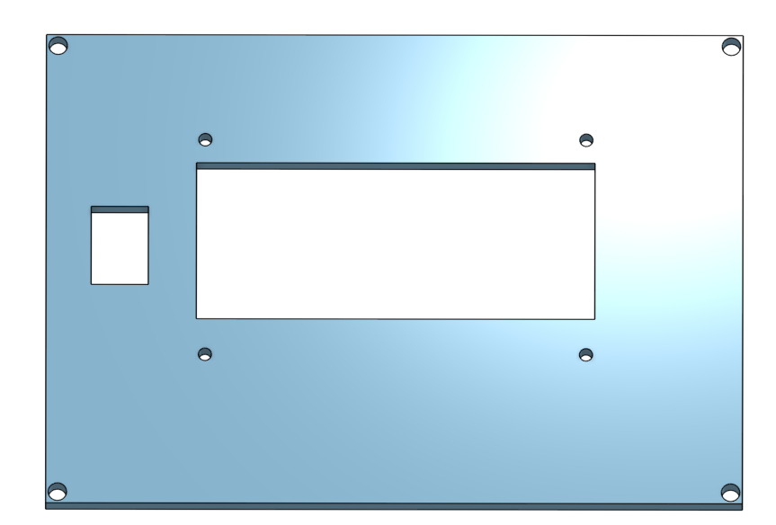
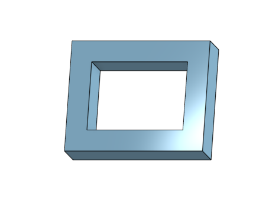
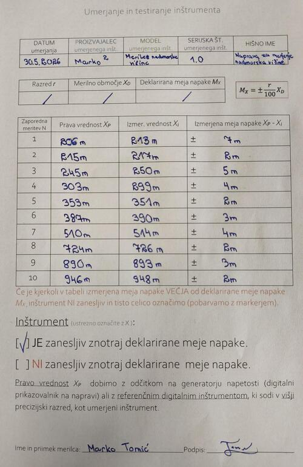

# Naprava za merjenje nadmorske višine 

### Opis projekta
Ustvarila sva napravo za merjenje nadmorske višine. Uporabila sva senzor BME280, ki s pomočjo meritev temperature, vlage in tlaka prek programske kode izračuna nadmorsko višino. Na LCD-zaslonu se izpisujejo nadmorska višina ter vsi podatki, ki vplivajo na njen izračun (temperatura, vlaga in tlak).

### Kosovnica
* Arduino UNO
* LCD 20x4
* BME280 senzor
* Stikalo za vklop/izklop
* Baterijski konektor
* Baterija
* Hitra sponka
* Povezovalne žičke

### Vezalna shema

### Načrt ohišja

### Pokrov

### Ohišje za senzor

### Izračuni in enačbe
Za izdelavo najine vezave nisva potrebovala komponent, ki bi potrebovale enačbe in izračune.

### Videoposnetek delovanja
https://github.com/user-attachments/assets/02deefcb-a9b5-40ab-951b-67d8feb4908a

Posnetek si lahko ogledate tudi na YouTubu: [Klikni me](https://youtube.com/shorts/nMZC6nQ5Q0s?feature=share)

### A-test

Največje odstopanje pri meritvah je bilo ± 3,3 %.

### Komentar
Merilna naprava deluje stabilno in v skladu s pričakovanji, meja napake pa je v mejah normale. Meritve so bile opravljene, ko je bil zračni tlak približno 1022 hPa. Ker je bil zračni tlak v času kalibracije blizu standardne vrednosti, so izračuni nadmorske višine natančni. Z vezavo sva imela veliko težav, saj so se žičke večkrat staknile, zato sva težavo rešila tako, da sva uporabila večpinske konektorje za Arduino žičke. Težave sva imela tudi s povezovanjem ozemljitev (GND), kjer sva potrebovala originalno hitro sponko, da je vezava delovala, kot bi morala. Mere modela ohišja Onshape so bile natančno izmerjene, razen prostor za senzor je bil premajhen, zato sva morala ta prostor razširiti/zbrusiti, da se je senzor lepo vmestil v ohišje. Prav tako sva dodala še posebno ohišje okoli senzorja za boljšo varnost in zaščito pri udarcu ob tla.
### Izboljšave
Za izboljšavo merilnika nadmorske višine bi lahko dodala gumba za kalibracijo zračnega tlaka v realnem času, uvedla programsko glajenje podatkov z drsnim povprečjem ali napravo opremila z GPS modulom in MicroSD kartico za beleženje poti.
