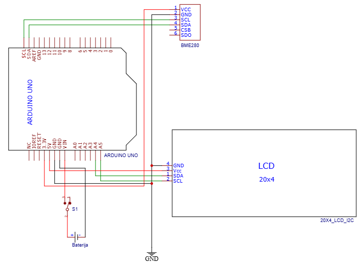

# Merjenje nadmorske višine

### 1. Opis projekta
Ustvarila sva napravo za merjenje nadmorske višine. Uporabila sva senzor BME280, ki s pomčjo meritev temprerature, vlage in tlaka skozi programsko kodo izračuna nadmorsko višino. Na LCD zaslonu se prikazujejo vsi podatki, ki vplivajo na izračun nadmorske višine (temperatura, vlaga, tlak). 

### 2. Kosovnica
* Arduino UNO
* LCD 20x4
* BME280 senzor
* Stikalo za vklop/izklop
* Baterijski konektor
* Baterija
* Hitra sponka
* Povezovalne žičke

### 3. Vezalna shema

### 4. Načrt ohišja

